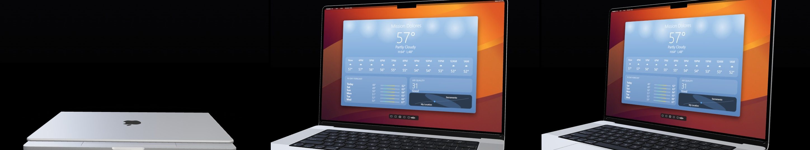
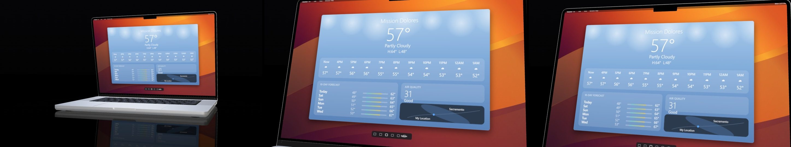
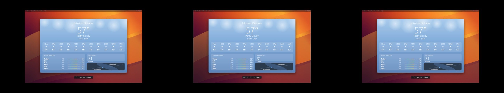
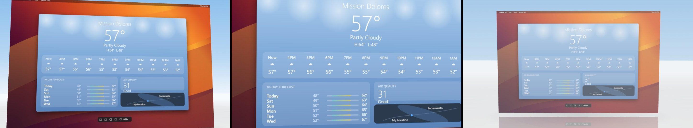
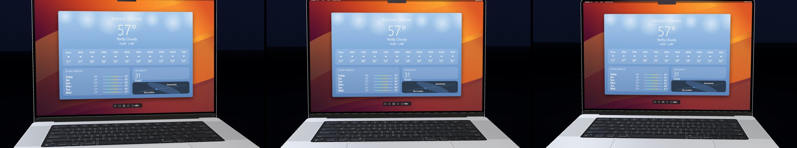
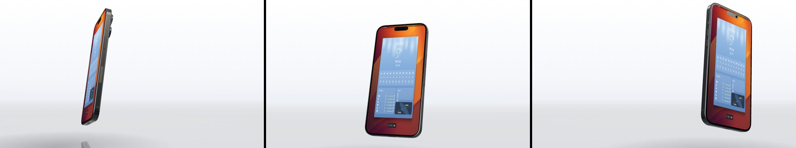

# Preset previews

Auto-generated by `tools/make-previews.mjs`. Each strip is three moments from the
shot — **start · middle · end** — rendered with the placeholder UI so what you are
looking at is the camera work, not the content.

Regenerate after adding or retuning a preset:

```bash
node src/lib/cinematic3d/tools/make-previews.mjs            # all
node src/lib/cinematic3d/tools/make-previews.mjs raw-2d     # one
```

## `laptop-reveal`

Opens on a shut laptop that reveals itself. Strong opener; the device is the subject.

Tuned at **8s** — the duration at which it reproduces the reference shot.
Other durations rescale its sub-cuts proportionally.



## `laptop-punch-reveal`

Punch in on an interaction, hold, then pull back a little to show what it affected. The workhorse for feature demos.

Tuned at **6.2s** — the duration at which it reproduces the reference shot.
Other durations rescale its sub-cuts proportionally.



## `raw-2d`

No 3D at all - the recording on black with a spring zoom. Cheapest to render and the most legible for dense UI.

Tuned at **4s** — the duration at which it reproduces the reference shot.
Other durations rescale its sub-cuts proportionally.



## `floating-panel`

Screen detaches from any device and floats over a reflective ground, orbiting. Good closing beat; can dissolve out.

Tuned at **10.3s** — the duration at which it reproduces the reference shot.
Other durations rescale its sub-cuts proportionally.



## `laptop-hold`

A long, patient shot with almost no movement. Use for a walkthrough that needs room to breathe.

Tuned at **7.2s** — the duration at which it reproduces the reference shot.
Other durations rescale its sub-cuts proportionally.



## `phone-showcase`

Phone spins in, demos, flash-zooms on a detail, spins out. Use for mobile captures.

Tuned at **10.3s** — the duration at which it reproduces the reference shot.
Other durations rescale its sub-cuts proportionally.


